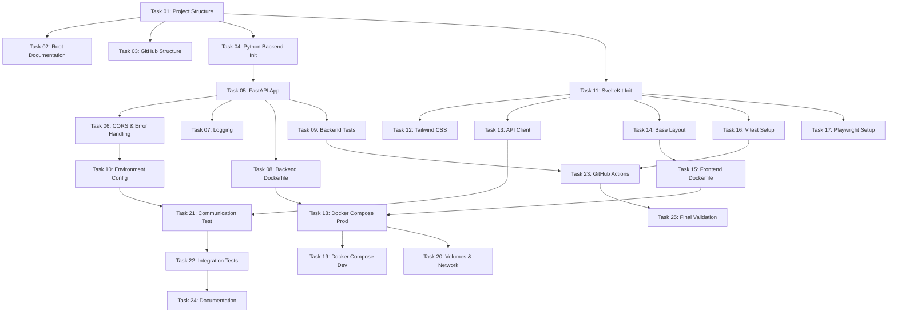

# Phase 1: Infrastructure - Task List

## Overview
This document lists all individual tasks for Phase 1 in the order they should be completed. Each task is designed to be self-contained and completable by an LLM with the provided instructions.

## Task Execution Order

### Project Foundation (Tasks 01-03)
- **Task 01**: Create base project structure and Git configuration
- **Task 02**: Create root-level documentation files (README, LICENSE)
- **Task 03**: Set up GitHub repository structure and workflows directory

### Backend Infrastructure (Tasks 04-10)
- **Task 04**: Initialize Python backend with FastAPI structure
- **Task 05**: Implement FastAPI application with health endpoints
- **Task 06**: Add CORS middleware and error handling
- **Task 07**: Configure logging system for the API
- **Task 08**: Create backend Dockerfile
- **Task 09**: Set up pytest and create first backend tests
- **Task 10**: Add backend environment configuration

### Frontend Infrastructure (Tasks 11-17)
- **Task 11**: Initialize SvelteKit project with TypeScript
- **Task 12**: Configure Tailwind CSS
- **Task 13**: Create API client service structure
- **Task 14**: Implement base layout and routing
- **Task 15**: Create frontend Dockerfile
- **Task 16**: Set up Vitest for component testing
- **Task 17**: Configure Playwright for E2E testing

### Docker Orchestration (Tasks 18-20)
- **Task 18**: Create docker-compose.yml for production
- **Task 19**: Create docker-compose.dev.yml for development
- **Task 20**: Create volume structure and networking

### Integration & Testing (Tasks 21-23)
- **Task 21**: Verify frontend-backend communication
- **Task 22**: Create integration test suite
- **Task 23**: Set up GitHub Actions CI/CD workflow

### Documentation & Finalization (Tasks 24-25)
- **Task 24**: Create comprehensive development documentation
- **Task 25**: Final validation and smoke tests

## Task Dependencies

## Time Estimates

| Task Range | Description | Estimated Time |
|------------|-------------|----------------|
| 01-03 | Project Foundation | 2 hours |
| 04-10 | Backend Infrastructure | 8 hours |
| 11-17 | Frontend Infrastructure | 7 hours |
| 18-20 | Docker Orchestration | 3 hours |
| 21-23 | Integration & Testing | 3 hours |
| 24-25 | Documentation | 2 hours |
| **Total** | **Phase 1 Complete** | **25 hours** |

## Success Criteria

Each task has specific success criteria defined in its individual task file. The overall phase is complete when:

1. ✅ Docker Compose brings up all services successfully
2. ✅ Frontend can communicate with backend API
3. ✅ All health check endpoints return 200 OK
4. ✅ Hot reload works in development mode
5. ✅ All tests pass (backend and frontend)
6. ✅ CI/CD pipeline runs successfully
7. ✅ Documentation is complete and accurate

## Notes for Task Execution

- Each task file contains all necessary context and instructions
- Tasks can be executed by different team members or LLMs
- Ensure each task's success criteria are met before moving to the next
- Some tasks can be done in parallel (see dependency graph)
- If a task fails, check its dependencies first
- Each task should commit its changes to Git upon completion

## File Naming Convention

Tasks are named as: `{number}-{category}-{description}.md`

Where:
- `number` is a two-digit task number (01-25)
- `category` is one of: project, backend, frontend, docker, integration, docs
- `description` is a short kebab-case description

Example: `01-project-base-structure.md`
