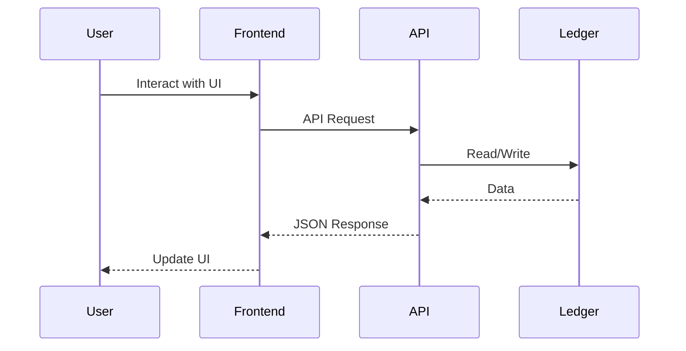

# Task 24: Create Comprehensive Development Documentation

## Context
This task creates comprehensive documentation for the Budget Tool MVP that serves as the primary reference for developers, operators, and stakeholders. Good documentation is crucial for onboarding new team members, maintaining the system, troubleshooting issues, and ensuring consistent development practices. This documentation will cover architecture, API specifications, deployment procedures, and development workflows.

## Objectives
- Document system architecture and design decisions
- Create API reference documentation
- Write development setup and workflow guides
- Document deployment and operations procedures
- Create troubleshooting and FAQ sections
- Establish documentation standards and templates
- Set up documentation generation and publishing
- Create onboarding guide for new developers

## Prerequisites
- All Phase 1 infrastructure tasks completed
- System running successfully in development
- API endpoints defined and working
- Testing frameworks configured
- CI/CD pipelines established
- Understanding of the complete system

## Task Instructions

### Step 1: Create Main README
Update `README.md` in the project root:

```markdown
# Budget Tool

[](https://github.com/your-org/budget-tool/actions)
[](https://codecov.io/gh/your-org/budget-tool)
[](LICENSE)

Self-hosted, open-source envelope budgeting application with plain text accounting.

## 🚀 Quick Start

```bash
# Clone the repository
git clone https://github.com/your-org/budget-tool.git
cd budget-tool

# Copy environment configuration
cp .env.example .env

# Start the application
docker-compose up -d

# Access the application
open http://localhost:3000
```

## 📋 Features

- **Envelope Budgeting**: Organize finances using the envelope method
- **Plain Text Accounting**: Human-readable ledger format (hledger/ledger compatible)
- **Self-Hosted**: Complete control over your financial data
- **Docker-Based**: Easy deployment with Docker Compose
- **Modern UI**: React-based frontend with responsive design
- **API-First**: RESTful API for all operations

## 🏗️ Architecture

```
┌─────────────┐     ┌─────────────┐     ┌─────────────┐
│   Browser   │────▶│   Frontend  │────▶│     API     │
│             │     │  (SvelteKit)│     │  (FastAPI)  │
└─────────────┘     └─────────────┘     └─────────────┘
                                               │
                                         ┌─────▼─────┐
                                         │  Ledger   │
                                         │   Files   │
                                         └───────────┘
```

## 📚 Documentation

- [Development Guide](docs/DEVELOPMENT.md)
- [API Documentation](docs/API.md)
- [Deployment Guide](docs/DEPLOYMENT.md)
- [Architecture](docs/ARCHITECTURE.md)
- [Contributing](CONTRIBUTING.md)

## 🧪 Testing

```bash
# Run all tests
make test

# Run specific test suites
make test-backend
make test-frontend
make test-integration
make test-e2e
```

## 🚢 Deployment

See [Deployment Guide](docs/DEPLOYMENT.md) for detailed instructions.

## 📝 License

MIT License - see [LICENSE](LICENSE) file for details.

## 🤝 Contributing

See [CONTRIBUTING.md](CONTRIBUTING.md) for contribution guidelines.

## 📮 Support

- [GitHub Issues](https://github.com/your-org/budget-tool/issues)
- [Discussions](https://github.com/your-org/budget-tool/discussions)
```

### Step 2: Create Development Guide
Create `docs/DEVELOPMENT.md`:

```markdown
# Development Guide

## Table of Contents
- [Prerequisites](#prerequisites)
- [Development Setup](#development-setup)
- [Project Structure](#project-structure)
- [Development Workflow](#development-workflow)
- [Testing](#testing)
- [Debugging](#debugging)
- [Code Style](#code-style)
- [Troubleshooting](#troubleshooting)

## Prerequisites

- Docker & Docker Compose (v2.0+)
- Node.js 18+ (for local frontend development)
- Python 3.11+ (for local backend development)
- Git
- Make (optional, for Makefile commands)

## Development Setup

### 1. Clone the Repository

```bash
git clone https://github.com/your-org/budget-tool.git
cd budget-tool
```

### 2. Configure Environment

```bash
# Copy example environment files
cp .env.example .env
cp api/.env.example api/.env
cp frontend/.env.example frontend/.env

# Edit .env files with your configuration
```

### 3. Start Development Environment

```bash
# Using docker-compose
docker-compose -f docker-compose.yml -f docker-compose.dev.yml up

# Or using Make
make dev
```

### 4. Access Services

- Frontend: http://localhost:3000
- API: http://localhost:8000
- API Docs: http://localhost:8000/docs

## Project Structure

```
budget-tool/
├── api/                    # Backend API (Python/FastAPI)
│   ├── app/               # Application code
│   │   ├── models/        # Data models
│   │   ├── routes/        # API endpoints
│   │   ├── services/      # Business logic
│   │   └── ledger/        # Ledger operations
│   ├── tests/             # Backend tests
│   └── requirements.txt   # Python dependencies
├── frontend/              # Frontend (SvelteKit)
│   ├── src/              # Source code
│   │   ├── lib/          # Shared components/utilities
│   │   └── routes/       # Page components
│   ├── tests/            # Frontend tests
│   └── package.json      # Node dependencies
├── volumes/              # Persistent data
│   ├── ledger/          # Ledger files
│   └── backup/          # Backups
├── scripts/             # Utility scripts
└── docker-compose.yml   # Docker configuration
```

## Development Workflow

### 1. Create Feature Branch

```bash
git checkout -b feature/your-feature-name
```

### 2. Make Changes

- Backend changes: `api/` directory
- Frontend changes: `frontend/` directory
- Hot reload is enabled for both services

### 3. Run Tests

```bash
# Backend tests
docker-compose exec api pytest

# Frontend tests
docker-compose exec frontend npm test

# Integration tests
./scripts/run-integration-tests.sh
```

### 4. Commit Changes

```bash
git add .
git commit -m "feat: your feature description"
```

### 5. Push and Create PR

```bash
git push origin feature/your-feature-name
# Create PR on GitHub
```

## Testing

### Unit Tests

```bash
# Backend
docker-compose exec api pytest tests/unit -v

# Frontend
docker-compose exec frontend npm run test:unit
```

### Integration Tests

```bash
./scripts/run-integration-tests.sh
```

### E2E Tests

```bash
cd frontend
npx playwright test
```

### Coverage Reports

```bash
# Backend coverage
docker-compose exec api pytest --cov=app --cov-report=html

# Frontend coverage
docker-compose exec frontend npm run test:coverage
```

## Debugging

### Backend Debugging

1. Add breakpoint in code:
   ```python
   import debugpy; debugpy.breakpoint()
   ```

2. Attach debugger to port 5678

### Frontend Debugging

1. Use browser DevTools
2. Add `debugger;` statements in code
3. Check console for errors

### Container Debugging

```bash
# View logs
docker-compose logs -f [service]

# Access container shell
docker-compose exec [service] /bin/bash

# Inspect container
docker inspect [container-name]
```

## Code Style

### Python (Backend)

- Follow PEP 8
- Use Black for formatting
- Use flake8 for linting
- Type hints required

```bash
# Format code
black app tests

# Lint code
flake8 app tests

# Type check
mypy app
```

### JavaScript/TypeScript (Frontend)

- Use ESLint configuration
- Use Prettier for formatting
- TypeScript strict mode

```bash
# Format code
npm run format

# Lint code
npm run lint

# Type check
npm run check
```

## Troubleshooting

### Common Issues

#### Services won't start
- Check port availability: `lsof -i :3000 -i :8000`
- Check Docker daemon: `docker ps`
- Review logs: `docker-compose logs`

#### Hot reload not working
- Check volume mounts: `docker-compose exec [service] ls -la`
- Verify file watching: Check CHOKIDAR_USEPOLLING env var
- Restart service: `docker-compose restart [service]`

#### Database/Ledger errors
- Check file permissions: `ls -la volumes/ledger`
- Verify ledger format: `cat volumes/ledger/main.ledger`
- Restore from backup: `./scripts/restore-volumes.sh`

#### Test failures
- Update dependencies: `docker-compose build --no-cache`
- Clear test cache: `docker-compose exec api pytest --cache-clear`
- Check test database: `docker-compose exec api ls /app/volumes/ledger`

### Getting Help

1. Check existing issues: [GitHub Issues](https://github.com/your-org/budget-tool/issues)
2. Search discussions: [GitHub Discussions](https://github.com/your-org/budget-tool/discussions)
3. Ask in development channel: #budget-tool-dev
```

### Step 3: Create API Documentation
Create `docs/API.md`:

```markdown
# API Documentation

## Base URL
- Development: `http://localhost:8000`
- Production: `https://api.budget-tool.example.com`

## Authentication
Currently no authentication (Phase 1). Will be added in future phases.

## Headers
```http
Content-Type: application/json
Accept: application/json
```

## Endpoints

### Health Check

#### GET /health
Check API health status

**Response**
```json
{
  "status": "healthy",
  "version": "1.0.0",
  "timestamp": "2024-01-01T12:00:00Z",
  "services": {
    "api": true,
    "ledger": true
  }
}
```

#### GET /ready
Check if API is ready to accept requests

**Response**
```json
{
  "ready": true
}
```

### Envelopes (Phase 3)

#### GET /api/envelopes
List all envelopes

**Query Parameters**
- `page` (integer): Page number (default: 1)
- `page_size` (integer): Items per page (default: 20)
- `search` (string): Search term

**Response**
```json
{
  "items": [
    {
      "id": "uuid",
      "name": "Groceries",
      "balance": 500.00,
      "goal_amount": 600.00,
      "type": "monthly",
      "created_at": "2024-01-01T00:00:00Z",
      "updated_at": "2024-01-01T00:00:00Z"
    }
  ],
  "total": 10,
  "page": 1,
  "page_size": 20,
  "total_pages": 1
}
```

#### POST /api/envelopes
Create new envelope

**Request Body**
```json
{
  "name": "Groceries",
  "type": "monthly",
  "goal_amount": 600.00,
  "description": "Monthly grocery budget"
}
```

**Response**
```json
{
  "id": "uuid",
  "name": "Groceries",
  "balance": 0.00,
  "goal_amount": 600.00,
  "type": "monthly",
  "created_at": "2024-01-01T00:00:00Z",
  "updated_at": "2024-01-01T00:00:00Z"
}
```

### Transactions (Phase 4)

#### POST /api/transactions/import
Import transactions from CSV

**Request**
- Content-Type: `multipart/form-data`
- File field: `file`

**Response**
```json
{
  "imported": 25,
  "duplicates": 3,
  "errors": 0,
  "transactions": [...]
}
```

## Error Responses

### 400 Bad Request
```json
{
  "detail": "Invalid request data",
  "errors": [
    {
      "field": "name",
      "message": "Field is required"
    }
  ]
}
```

### 404 Not Found
```json
{
  "detail": "Resource not found"
}
```

### 500 Internal Server Error
```json
{
  "detail": "Internal server error",
  "error_id": "uuid-for-tracking"
}
```

## Rate Limiting
- 100 requests per minute per IP
- Headers indicate limit status:
  - `X-RateLimit-Limit`
  - `X-RateLimit-Remaining`
  - `X-RateLimit-Reset`

## OpenAPI Specification
Full OpenAPI spec available at `/openapi.json`
Interactive documentation at `/docs`
```

### Step 4: Create Architecture Documentation
Create `docs/ARCHITECTURE.md`:

```markdown
# Architecture Documentation

## System Overview

Budget Tool follows a microservices architecture with clear separation between frontend and backend services.

## Components

### Frontend (SvelteKit)
- **Purpose**: User interface and experience
- **Technology**: SvelteKit, TypeScript, Tailwind CSS
- **Port**: 3000
- **Responsibilities**:
  - User interface rendering
  - Client-side routing
  - API communication
  - State management

### Backend API (FastAPI)
- **Purpose**: Business logic and data management
- **Technology**: Python, FastAPI, Pydantic
- **Port**: 8000
- **Responsibilities**:
  - API endpoints
  - Data validation
  - Ledger file management
  - Business logic

### Data Storage (Plain Text)
- **Format**: hledger/ledger compatible plain text
- **Location**: `volumes/ledger/`
- **Backup**: Automated daily/weekly/monthly
- **Benefits**:
  - Human readable
  - Version control friendly
  - No database dependency
  - Portable

## Data Flow



## Design Patterns

### API Design
- RESTful principles
- JSON request/response
- Consistent error handling
- Pagination for lists
- OpenAPI documentation

### Frontend Architecture
- Component-based design
- Client-side routing
- Reactive state management
- Progressive enhancement

### Error Handling
- Structured error responses
- Error boundaries in frontend
- Logging and monitoring
- Graceful degradation

## Security Considerations

### Current Implementation (Phase 1)
- CORS configuration
- Input validation
- SQL injection prevention (no DB)
- XSS protection

### Future Enhancements
- Authentication (JWT)
- Authorization (RBAC)
- HTTPS enforcement
- Rate limiting
- API keys

## Performance Optimization

### Backend
- Async request handling
- Connection pooling (future)
- Response caching
- Query optimization

### Frontend
- Code splitting
- Lazy loading
- Asset optimization
- CDN usage (production)

## Scalability

### Horizontal Scaling
- Stateless API design
- Load balancer ready
- Shared volume for ledger
- Container orchestration

### Vertical Scaling
- Resource limits configured
- Memory optimization
- CPU utilization monitoring

## Monitoring & Observability

### Logging
- Structured logging
- Log levels (DEBUG, INFO, WARNING, ERROR)
- Centralized log collection (future)

### Metrics
- Health endpoints
- Performance metrics
- Error rates
- Response times

### Tracing
- Request IDs
- Distributed tracing (future)
- Error tracking

## Development vs Production

### Development
- Hot reload enabled
- Debug endpoints
- Verbose logging
- Mock data available

### Production
- Optimized builds
- Security headers
- Rate limiting
- Monitoring enabled
```

### Step 5: Create Deployment Documentation
Create `docs/DEPLOYMENT.md`:

```markdown
# Deployment Guide

## Prerequisites

- Docker and Docker Compose installed
- Domain name configured (for production)
- SSL certificate (for production)
- Backup storage configured

## Production Deployment

### 1. Server Setup

```bash
# Update system
sudo apt update && sudo apt upgrade -y

# Install Docker
curl -fsSL https://get.docker.com | sh

# Install Docker Compose
sudo curl -L "https://github.com/docker/compose/releases/latest/download/docker-compose-$(uname -s)-$(uname -m)" -o /usr/local/bin/docker-compose
sudo chmod +x /usr/local/bin/docker-compose
```

### 2. Clone Repository

```bash
git clone https://github.com/your-org/budget-tool.git
cd budget-tool
```

### 3. Configure Environment

```bash
# Copy production environment template
cp .env.production.example .env.production

# Edit with your configuration
nano .env.production
```

Required configuration:
```env
DOMAIN=budget-tool.example.com
SECRET_KEY=your-very-secure-secret-key
ALLOWED_HOSTS=budget-tool.example.com
CORS_ALLOWED_ORIGINS=https://budget-tool.example.com
```

### 4. SSL Certificate Setup

Using Let's Encrypt:
```bash
# Install certbot
sudo apt install certbot

# Generate certificate
sudo certbot certonly --standalone -d budget-tool.example.com
```

### 5. Deploy Application

```bash
# Build and start services
docker-compose -f docker-compose.yml -f docker-compose.prod.yml up -d

# Verify services
docker-compose ps

# Check health
curl https://budget-tool.example.com/health
```

### 6. Configure Nginx (Optional)

```nginx
server {
    listen 443 ssl http2;
    server_name budget-tool.example.com;
    
    ssl_certificate /etc/letsencrypt/live/budget-tool.example.com/fullchain.pem;
    ssl_certificate_key /etc/letsencrypt/live/budget-tool.example.com/privkey.pem;
    
    location / {
        proxy_pass http://localhost:3000;
        proxy_set_header Host $host;
        proxy_set_header X-Real-IP $remote_addr;
    }
    
    location /api {
        proxy_pass http://localhost:8000;
        proxy_set_header Host $host;
        proxy_set_header X-Real-IP $remote_addr;
    }
}
```

## Backup Configuration

### Automated Backups

```bash
# Add to crontab
crontab -e

# Daily backup at 2 AM
0 2 * * * /path/to/budget-tool/scripts/backup-volumes.sh
```

### Manual Backup

```bash
./scripts/backup-volumes.sh
```

### Restore from Backup

```bash
./scripts/restore-volumes.sh /path/to/backup.tar.gz
```

## Monitoring

### Health Checks

```bash
# API health
curl https://budget-tool.example.com/api/health

# Frontend health
curl https://budget-tool.example.com/health

# Container status
docker-compose ps
```

### Logs

```bash
# View all logs
docker-compose logs

# Follow specific service
docker-compose logs -f api

# Last 100 lines
docker-compose logs --tail=100
```

## Updates

### Application Updates

```bash
# Pull latest changes
git pull origin main

# Rebuild and restart
docker-compose down
docker-compose build --no-cache
docker-compose up -d
```

### System Updates

```bash
# Update packages
sudo apt update && sudo apt upgrade -y

# Update Docker
sudo apt install --only-upgrade docker-ce

# Reboot if needed
sudo reboot
```

## Rollback Procedure

```bash
# Stop current version
docker-compose down

# Checkout previous version
git checkout tags/v1.0.0

# Restore backup if needed
./scripts/restore-volumes.sh /backups/last-known-good.tar.gz

# Start previous version
docker-compose up -d
```

## Troubleshooting

### Service Won't Start
```bash
# Check logs
docker-compose logs [service]

# Check resources
df -h
free -m
docker system df

# Clean up
docker system prune -a
```

### Performance Issues
```bash
# Check container resources
docker stats

# Increase limits in docker-compose.yml
deploy:
  resources:
    limits:
      cpus: '2'
      memory: 2G
```

### SSL Certificate Issues
```bash
# Renew certificate
sudo certbot renew

# Restart services
docker-compose restart nginx
```
```

### Step 6: Create Contributing Guide
Create `CONTRIBUTING.md`:

```markdown
# Contributing to Budget Tool

Thank you for your interest in contributing to Budget Tool! This document provides guidelines and instructions for contributing.

## Code of Conduct

By participating in this project, you agree to abide by our Code of Conduct:
- Be respectful and inclusive
- Welcome newcomers and help them get started
- Focus on constructive criticism
- Accept feedback gracefully

## How to Contribute

### Reporting Issues

1. Check existing issues to avoid duplicates
2. Use issue templates when available
3. Provide clear descriptions and steps to reproduce
4. Include system information and logs when relevant

### Suggesting Features

1. Open a discussion first for major features
2. Explain the use case and benefits
3. Consider implementation complexity
4. Be open to alternatives

### Submitting Code

1. Fork the repository
2. Create a feature branch
3. Write tests for new functionality
4. Ensure all tests pass
5. Submit a pull request

## Development Process

### 1. Setup Development Environment

```bash
git clone https://github.com/your-username/budget-tool.git
cd budget-tool
make dev
```

### 2. Branch Naming

- Feature: `feature/description`
- Bugfix: `fix/description`
- Documentation: `docs/description`
- Refactor: `refactor/description`

### 3. Commit Messages

Follow conventional commits:

```
type(scope): description

[optional body]

[optional footer]
```

Types:
- `feat`: New feature
- `fix`: Bug fix
- `docs`: Documentation
- `style`: Formatting
- `refactor`: Code restructuring
- `test`: Adding tests
- `chore`: Maintenance

### 4. Testing

```bash
# Run all tests
make test

# Run specific tests
make test-backend
make test-frontend
```

### 5. Code Style

Backend (Python):
```bash
black app tests
flake8 app tests
mypy app
```

Frontend (JavaScript/TypeScript):
```bash
npm run format
npm run lint
```

## Pull Request Process

1. **Update Documentation**: Update README.md and other docs as needed
2. **Add Tests**: Include tests for new functionality
3. **Pass CI**: Ensure all CI checks pass
4. **Request Review**: Request review from maintainers
5. **Address Feedback**: Respond to review comments
6. **Squash Commits**: Squash commits before merge if requested

### PR Template

```markdown
## Description
Brief description of changes

## Type of Change
- [ ] Bug fix
- [ ] New feature
- [ ] Documentation update
- [ ] Performance improvement

## Testing
- [ ] Unit tests pass
- [ ] Integration tests pass
- [ ] Manual testing completed

## Checklist
- [ ] Code follows style guidelines
- [ ] Self-review completed
- [ ] Documentation updated
- [ ] No breaking changes
```

## Release Process

1. Maintainers create release branch
2. Version bump and changelog update
3. Testing on staging environment
4. Tag release and create GitHub release
5. Deploy to production

## Getting Help

- Join our Discord server: [invite link]
- Check the documentation: [/docs](./docs)
- Ask in GitHub Discussions
- Contact maintainers: [email]

## Recognition

Contributors are recognized in:
- README.md contributors section
- GitHub contributors page
- Release notes

Thank you for contributing to Budget Tool!
```

### Step 7: Create FAQ Documentation
Create `docs/FAQ.md`:

```markdown
# Frequently Asked Questions

## General

### What is Budget Tool?
Budget Tool is a self-hosted envelope budgeting application that uses plain text accounting principles to help you manage your personal finances.

### Why plain text accounting?
- Human readable format
- No vendor lock-in
- Version control friendly
- Works with existing tools (hledger/ledger)
- Complete data ownership

### Is my data secure?
Yes, when self-hosted:
- Data stays on your server
- No cloud dependencies
- You control access
- Regular backups

## Installation

### What are the system requirements?
- Docker and Docker Compose
- 2GB RAM minimum
- 10GB disk space
- Linux/macOS/Windows

### Can I run it without Docker?
Yes, but not recommended. You would need:
- Python 3.11+
- Node.js 18+
- Manual service configuration

### How do I update?
```bash
git pull origin main
docker-compose down
docker-compose build
docker-compose up -d
```

## Usage

### How do I import bank transactions?
1. Export CSV from your bank
2. Go to Import page
3. Upload CSV file
4. Map columns if needed
5. Categorize transactions

### What envelope types are available?
- Monthly: Recurring monthly expenses
- Annual: Yearly payments
- Goal: One-time savings goals
- Default: General cash envelope

### Can I edit past transactions?
Yes, transactions can be edited. The ledger maintains an audit trail of changes.

### How do I backup my data?
Automatic backups run daily. Manual backup:
```bash
./scripts/backup-volumes.sh
```

## Troubleshooting

### Frontend won't load
1. Check if services are running: `docker-compose ps`
2. Check browser console for errors
3. Verify URL is correct
4. Clear browser cache

### API errors
1. Check API health: `curl http://localhost:8000/health`
2. Review logs: `docker-compose logs api`
3. Verify environment variables
4. Check file permissions

### Data not persisting
1. Check volume mounts: `docker volume ls`
2. Verify write permissions
3. Check disk space: `df -h`
4. Review ledger file: `cat volumes/ledger/main.ledger`

### Performance issues
1. Check resource usage: `docker stats`
2. Increase container limits
3. Clear temporary files
4. Optimize ledger file size

## Development

### How do I contribute?
See [CONTRIBUTING.md](../CONTRIBUTING.md) for guidelines.

### Where do I report bugs?
GitHub Issues: https://github.com/your-org/budget-tool/issues

### Can I add custom features?
Yes! Fork the repository and submit a pull request.

## Future Plans

### Planned features?
- Multi-user support
- Mobile apps
- Bank API integration
- Advanced reporting
- Budget templates

### Release schedule?
- Monthly minor releases
- Quarterly major releases
- Security patches as needed

## Support

### How do I get help?
1. Check documentation
2. Search GitHub issues
3. Ask in discussions
4. Contact maintainers

### Is there commercial support?
Not currently, but planned for future.
```

### Step 8: Create Scripts Documentation
Create `docs/SCRIPTS.md`:

```markdown
# Scripts Documentation

All utility scripts are located in the `scripts/` directory.

## Development Scripts

### dev.sh
Manage development environment

```bash
./scripts/dev.sh start    # Start dev environment
./scripts/dev.sh stop     # Stop dev environment
./scripts/dev.sh restart  # Restart services
./scripts/dev.sh logs     # View logs
./scripts/dev.sh shell    # Open shell in container
```

## Testing Scripts

### run-tests.sh
Execute test suites

```bash
./scripts/run-tests.sh unit         # Unit tests
./scripts/run-tests.sh integration  # Integration tests
./scripts/run-tests.sh e2e         # E2E tests
./scripts/run-tests.sh all         # All tests
```

### test-communication.sh
Verify service communication

```bash
./scripts/test-communication.sh
```

## Volume Management

### setup-volumes.sh
Initialize Docker volumes

```bash
./scripts/setup-volumes.sh
```

### backup-volumes.sh
Create backup of data

```bash
./scripts/backup-volumes.sh          # Automatic backup
./scripts/backup-volumes.sh daily    # Force daily backup
./scripts/backup-volumes.sh monthly  # Force monthly backup
```

### restore-volumes.sh
Restore from backup

```bash
./scripts/restore-volumes.sh backup-file.tar.gz
```

### monitor-volumes.sh
Check volume status

```bash
./scripts/monitor-volumes.sh
```

## Deployment Scripts

### deploy.sh
Deploy to production

```bash
./scripts/deploy.sh staging     # Deploy to staging
./scripts/deploy.sh production  # Deploy to production
```

### health-check.sh
Check service health

```bash
./scripts/health-check.sh
```

## Utility Scripts

### docker-build.sh
Build Docker images

```bash
./scripts/docker-build.sh production  # Production build
./scripts/docker-build.sh development # Development build
```

### setup-repo.sh
Configure GitHub repository

```bash
./scripts/setup-repo.sh
```

## Creating New Scripts

Template for new scripts:

```bash
#!/bin/bash

set -e

# Colors
GREEN='\033[0;32m'
RED='\033[0;31m'
NC='\033[0m'

print_status() {
    echo -e "${GREEN}[SCRIPT]${NC} $1"
}

print_error() {
    echo -e "${RED}[ERROR]${NC} $1"
}

# Script logic here
print_status "Starting script..."

# Always provide help
if [ "$1" = "--help" ] || [ "$1" = "-h" ]; then
    echo "Usage: $0 [options]"
    echo "Description of what this script does"
    exit 0
fi
```
```

## Expected File Structure
After completing this task:

```
budget-tool/
├── README.md (updated)
├── CONTRIBUTING.md
├── docs/
│   ├── DEVELOPMENT.md
│   ├── API.md
│   ├── ARCHITECTURE.md
│   ├── DEPLOYMENT.md
│   ├── FAQ.md
│   └── SCRIPTS.md
```

## Success Criteria
- [ ] README provides clear project overview
- [ ] Development guide enables quick onboarding
- [ ] API documentation is complete and accurate
- [ ] Architecture is well documented
- [ ] Deployment guide works for production
- [ ] Contributing guide is welcoming
- [ ] FAQ answers common questions
- [ ] All code examples are tested
- [ ] Documentation is searchable
- [ ] Links between documents work

## Validation Commands
Run these commands to verify documentation:

```bash
# Check markdown syntax
markdownlint docs/*.md

# Check links
markdown-link-check README.md
markdown-link-check docs/*.md

# Build documentation site (if using MkDocs)
mkdocs build
mkdocs serve

# Test code examples
grep -h '```bash' docs/*.md | grep -v '```' | bash -n

# Check spelling
aspell check docs/*.md

# Generate PDF (if needed)
pandoc docs/DEVELOPMENT.md -o development-guide.pdf
```

## Troubleshooting
- If links break: Use relative paths and verify file structure
- If code examples fail: Test all commands before documenting
- If formatting issues: Use markdown linter
- For missing information: Interview users for common questions
- If too technical: Add glossary and simplify language
- For maintenance: Set up documentation review schedule

## Notes
- Keep documentation close to code
- Update docs with code changes
- Use examples and diagrams
- Write for your audience
- Make it searchable
- Version documentation with code
- Consider